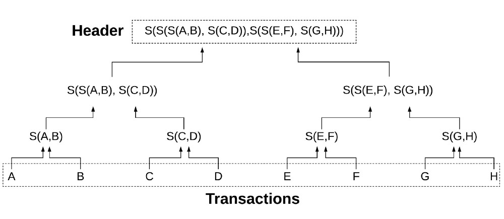
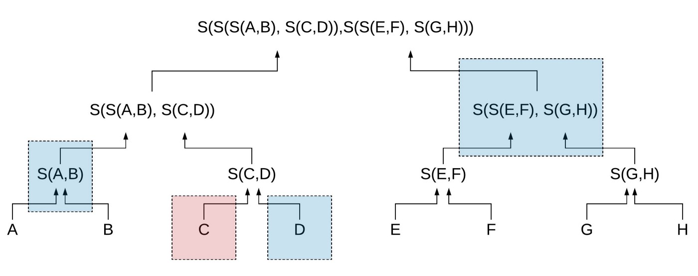

# Merkle Proof and Verification

## Introduction

Merkle trees are hash-based data structures used to prove the integrity of transaction data stored in the block. **For this exercise you may assume that all trees are binary, balanced, and that the number of transactions to be stored are some exponent of two.**

_Source: [Grid+](https://blog.gridplus.io/efficiently-bridging-evm-blockchains-8421504e9ced)_

Above you can see what this tree would look like. The eight transactions in the block (A-H) are lined up in the bottom row. The second row contains four hashes (S(X) = sha3 hash) of the child transactions. The third row contains hashes of the child hashes, and the root contains a hash of the hashes of the hashes of the transactions. Generically, this is how the transaction part of an Ethereum block is laid out and the root here is what we know of as a transaction header (one of the 15 pieces of information that goes into the block header).

## The Problem

The reason we use Merkle trees to store block data (i.e. transactions) is that verification is very efficient. This verification is called a Merkle proof.

Suppose we want to prove that transaction C was indeed in the block that formed the header shown above.

_Source: [Grid+](https://blog.gridplus.io/efficiently-bridging-evm-blockchains-8421504e9ced)_

In addition to the transaction hash C , we also need D, S(A,B), and S(S(E,F),S(G,H)) to form the proof. The verification itself performs the following steps on the proof:

* Hash C and D to produce S(C,D).
* Hash S(A,B) and S(C,D) to produce S(S(A,B),S(C,D)).
* Hash S(S(A,B),S(C,D)) and S(S(E,F),S(G,H)) to produce the root.
* Check that the root is the same as what has been stored previously.

The efficiency here is that we proved a transaction belonged in a block with only 3 accompanying pieces of information (instead of the 7 other transactions that were stored in the block). This efficiency becomes exponentially more pronounced with larger trees.

It will be your job to implement the Merkle proof functionality and to verify it.

# Merkle Patricia Trie and RLP

Repo supporting blog post at http://easythereentropy.wordpress.com/2014/06/04/understanding-the-ethereum-trie/
